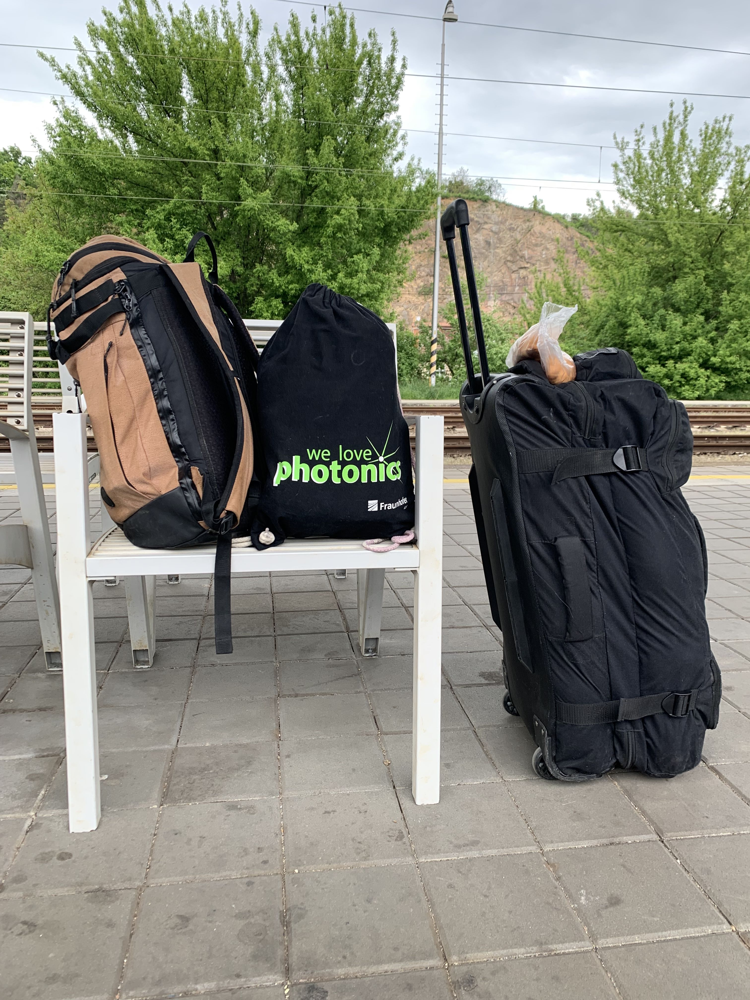
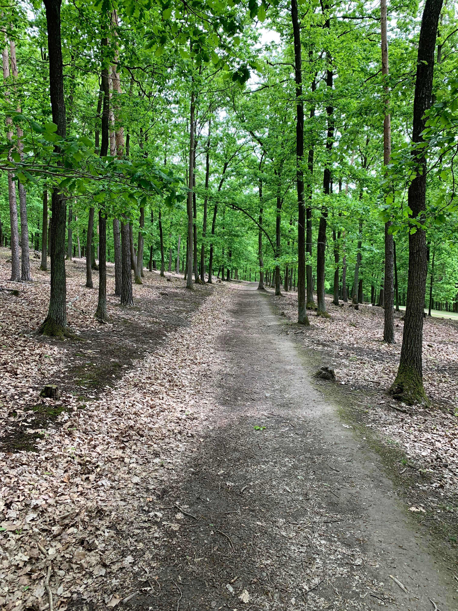
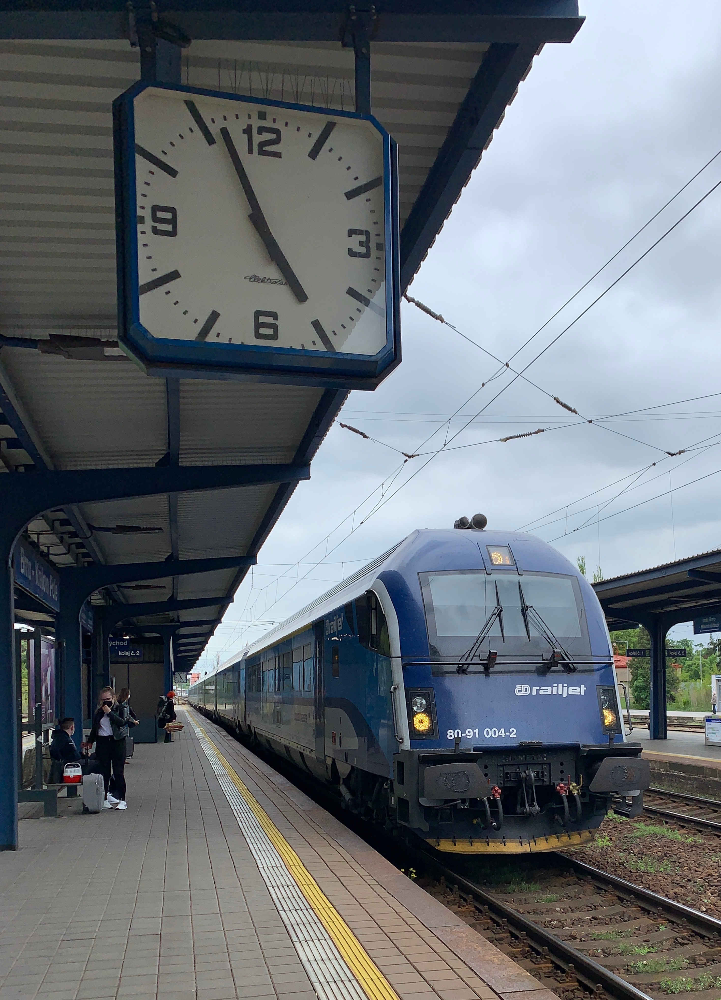

# 0. zápis - proč a kam jedu?

> Říkal jsem si, že předtím než začnete číst si k tomu pusťte hudbu. Tentokrát doporučuji _She's leaving home_ z legendárního Beatlesáckého alba Sgt. Pepper's Lonely Hearts Club Band. Težko bych hledal něco vhodnějšího. Poslední rok byl celkem osamnělý - She's leaving home after living alone for so many years. Brno je úžasné a málokde jsou tak skvělé podmínky  - We gave her everything money could buy. Zas musím zdůraznit, že se mnou v Brně bylo zacházeno neprosto prvotřídně, nikdo neudělal nic špatně a rodiče po mě tolik nesmutní (aspoň myslím teda). Každopádně si to pusťte.

<iframe allow="autoplay *; encrypted-media *; fullscreen *" frameborder="0" height="150" style="width:100%;max-width:660px;overflow:hidden;background:transparent;" sandbox="allow-forms allow-popups allow-same-origin allow-scripts allow-storage-access-by-user-activation allow-top-navigation-by-user-activation" src="https://embed.music.apple.com/cz/album/shes-leaving-home/1441164604?i=1441164863&l=cs"></iframe>

<iframe src="https://open.spotify.com/embed/track/3PjMtNzwhDHqxoKudm6GvF" width="660" height="150" frameborder="0" allowtransparency="true" allow="encrypted-media"></iframe>

Stojím na nástupišti Královopolského nádraží a je to zvláštní. Trochu si připadám jak Harry Potter, jen teda nemám školní uniformu a má taška není zdaleka tak stylová jako kufry ve filmu. Dnes jedu do Prahy a zítra přes Drážďany, Halle až do Jeny.

Ještě jsem dnes byl doměřit praktika ve škole, se spolužáky si zašel na kebap. Odpoledne jsem si skočil do Rebelbeanu pro výborný batchbrew a na nějakou dobu se rozloučil s oborou na holedné. Tohle místo mi bude celkem chybět.

Je dost možné, že malinko přeháním. Na duhou stranu je dobré podotknout, že celých jednadvacet let žiji v Brně s rodiči a nějakému osamostatňování se a pokročilejšímu dospívání jsem se zatím celkem úspěšně vyhýbal. Navíc jsem zatím opouštěl tuto zemi nanejvýš na dva týdny a to ještě jsem vždy byl někde na dovolené.

## Proč jedu na stáž?

Když jsem dostal nápad si stáž v Jeně zařídit, tak jsem nijak neřeil, že poprvé vypadnu z domu. Říkal jsem si, že bych (si) konečně mohl dokázat, že se dokážu prosadit v zahraničí. Zkusit získat kontakty a případně si vyhlídnout místo pro další působení. 

Stáž mi na Leibnizově institutu fotonickéch technologií (Leibnitz Institut für Photonische Technologien) ve skupině prof. Heintzmanna domluvil prof. Chmelík. Samotného mě překvapilo, jak všichni byli rád, že se o něco podobného snažím a zajímám.

Později se mé motivy začaly z touhy prosadit se měnit na: "Konečně vypadnu z domu, každé ráno vstanu a půjdu dál než do kuchyně pro kafe a zpět a hlavně budu něco dělat rukama." Nutno podotknout, že po roce povinného Home-office se na toto stále těším. Jen zhruba před týdenm mě najednou překvapilo, jak už je to blízko. V hlavě jsem měl: "jo, tak na tu stáž jedu až za dlouho, teď na to nemusím myslet." Bum a najednou odjezd byl tady.

## Kamže jedu?

Možná si říkáte, proč zrovna Jena? Vždyť většina z vás nejspíš neví, že toto město existuje. Proč si si raději nevybrat nějaké velké centrum jako třeba Mnichov nebo Berlín? Mno k odpovědi se hned dostanu.

Jena je velmi podobná Zlínu, žije v ní zhruba 100 tisíc obyvatel a také se rozprostírá v údolí. Jen tímto údolím neteče Dřevnice nýbrž Sála (_Saale_). Tím ale paralela nekončí, zlínu dal slávu Tomáš Baťa, když tam začal vyrábět boty. Jenu v 19. století proslavil Carl Zeiss a Ernst Abbe výrobou mikroskopů. Ostatně značka Carl Zeiss je dodnes zárukou kvality a prvotřídní technické úrovně snad u všech typů optických přístrojů. Od Zeisse koupíte opravdu vše od brýlových čoček, přes fotografické objektivy až po mikroskopy se superrozličení či špičkové EUV fotolitografy (mašina, na které se varábí čipy, více na [Wiki](https://en.wikipedia.org/wiki/Extreme_ultraviolet_lithography)).

_Já se sochou Ernsta Abbeho před planetáriem v Jeně._

Svobodný stát Durinsko (_Freistaat Thüringen_), kde se Jena nachází po druhé světové válce spadl do Sovětské okupační zóny a stal se součástí Východního Německa (_DDR - Deutsche Demokratische Republik_). Podobně jako u nás, tak i ve Východním Německu byly podniky znárodňovány a stejně tak i východoněmecké pobočky Carl Zeiss. Výroba v nich ale pokračovala, takže pokud máte doma východoněmecký dalekohled nebo objektiv, tak to nejspíš bude velmi kvalitní optika.

Před revolucí v roce 89 podle všeho u Zeisse pracovalo asi 35 tisíc lidí, což na stotisícové město není málo. Samozřejmě, že po revoluci všichni nezůstali. Komunismusudělal v Nšmecku podobné škody jak u nás. Avšak šikovní lidé v Jeně zůstali a začali zakládat další optické firmy. Rozhodně není daleko od pravdy, že toto statisícové město je Mekkou všech optiků. Krom velkých firem jako je Carl Zeiss, Schott nebo Jenoptik se zde nachází ústavy Fraunhoferovy a Leibnizovy společnosti (_Fraunhofer Gesellschaft_, _Leibniz Gemeinschaft_). Ve městě taktéž naleznete Univerzitu Fridricha Schillera (_Fridrich Schiller Universität_), která je desátou nejstarší v Německu. Desátá možná nezná tak skvěle, ale byla založena roku 1558 čili stále dřív než Olomoucká univerzita (1573 druhá nejstarší v ČR).

Ve městě jsem si na dva měsíce pronajal pokoj ve studentském domě (_die Wohngemeinschaft - WG_), který bych měl sdílet s dalšími šesti spolubydlícími. Po úvodním videohovoru na Zoomu na mě všichni působili velmi mile a otevřeně, tak se už na ně těším. A celkové jsem zvědavý jací Němci budou na jejich kulturu.

Už při shánění bydlení jsem totiž narazil na několik velmi milých a vlídných lidí, kteří ačkoli mne třeba museli odmítnout jako spolubydlícího, tak jsme se domluvili, že se aspoň uvidíme a poznáme se. 

Například Eva mi nabízela pokoj její kamarádky, která se do něj nakonec nastěhovala zpět a tudíž nebyl volný pro mě. Tak právě jí bylo velmi líto, že mne musela odmítnou a hned mi začala pomáhat shánět bydlení jinde. Zeptala se kamarádů a poslala mi pár inzerátů z internetu. Velmi mile mě překvapila její ochota mi pomoct. Skoro si teď říkám, že snad s žádným národem zatím nemám tak pozitivní zkušenost jako s Němci.

S sebou jsem si přibalil šest lahví Moravského vína a tři litry Dalešického piva, tak věřím, že mi pomohou mezi místní zapadnout.

Ale to uvidíme. Teď už jen přespat u kamarádky v Praze a hurá do Jeny.

Bis bald.