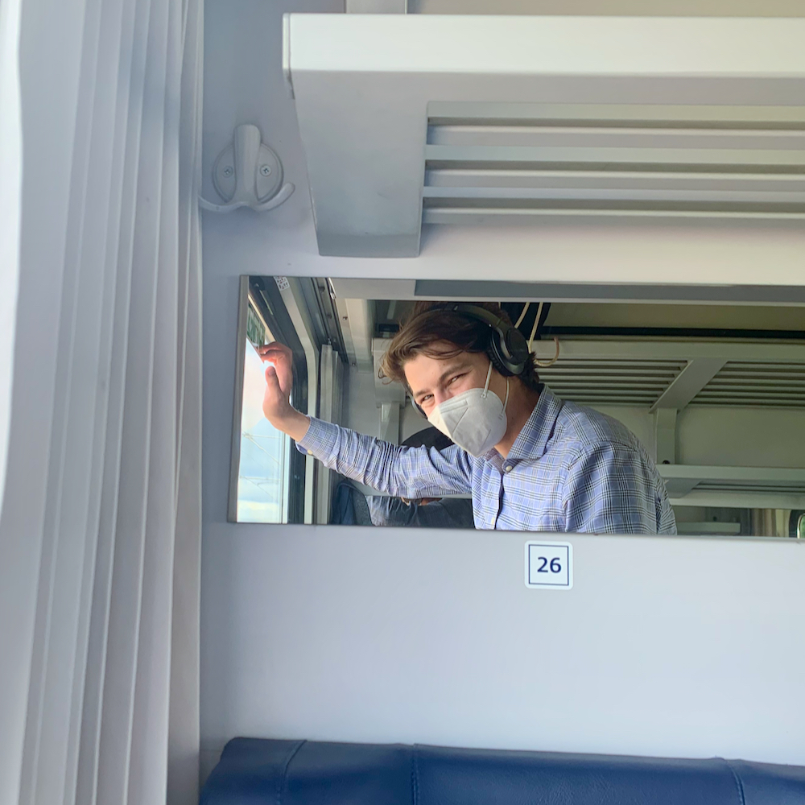

# 1. zápis - cesta a zabydlení se

> Tentokrát nemohu doporučit nic jiného než Deutsche Bahn od Wise Guys (spolužácí z Křenky znají). Na videu je pěkně vidět jaká je úroveň Německých drah - vyjdou tak nastejno jako ty české.

<iframe width="100%" height="315"  src="https://www.youtube-nocookie.com/embed/wXjhszy2f9w" title="YouTube video player" frameborder="0" allow="accelerometer; autoplay; clipboard-write; encrypted-media; gyroscope; picture-in-picture" allowfullscreen></iframe>

Když je člověk zvyklý vyspávat do půl desáté, tak budíček v sedm ráno není úplně příjemný. Po chvíli vstanu z nafukovací matrace v obýváku kamarádčina bytu. Domlouvali jsme se, že v sedm budu vstávat a už je 7:15. Tak kde je? Opatrně vejdu do jejího pokoje a ověřím si, že je vzhůru.

O chvíli později už do sebe láduji Müsli s jogurtem a kafe, tolik potřebný kofein k nastartování. Dojím a vidím, že je už skoro osm, tak rychle posbírám cestovní tašku, batoh, vak a plátěnku a ověšený jak vánoční stromeček utíkám na nádraží, kde nasedám do vlaku směr Drážďany. Milé bylo když k nám přišel pán s nabídkou občerstvení. Přišel a hned začal nabízet: "Zákusek ke kávičce pro slečnu, pivečko pro pány a podívejte, tady máme hořické trubičky s pendolínem." Byl milý a velmi dobře naladěný, až mi bylo líto, že si nic nekupuji.

> Nemůžu si pomoct a neukázat skály, které jsem viděl všude okolo při průjezdu Českým i Saským švýcarskem. Někdy to tam musím prozkoumat.

> Dominanta drážďanského nádraží. No není k sežrání?

V sudetech se mě opustili spolucestující v mém kupé a během půlhodinky jsem v Drážďanech vystupoval i já. Bylo těsně před jedenáctou a když jsem šel okolo Burger Kingu tak jsem si uvědomil, že mám hlad. Přišel jsem k přepážce a poprosil o Whooper menu s hranolkami a kolou. Paní se zeptala: “Ketchup oder mayo?” “Mayo”, odpovím (kečup opravdu nemusím). V tu chvíli jsem si vzpomněl na onu scénku z Pulp Fiction. Na nástupišti jsem si rozdělal burger a vlasníma rukama jsem začal v tý sračce topit hranolky. Jídlo jsem dojedl ve vlaku směr Lipsko a Halle. Ono i v Německu nikdo moc neřeší, že si na chvilku sundáte respirátor.

> Balení z Burger Kingu v inter city směr Kolín nad Rýnem.

<iframe width="100%" height="315" src="https://www.youtube-nocookie.com/embed/3ZrbxcjaE4s" title="YouTube video player" frameborder="0" allow="accelerometer; autoplay; clipboard-write; encrypted-media; gyroscope; picture-in-picture" allowfullscreen></iframe>

> Pro ty co neznají nebo si nepamatují Pulp Fiction. V Drážďanech je Whooper prostě Whooper.

Nádraží v Lipsku mě velmi překvapilo. Sice jsem nevystupoval, ale ještě nikdy jsem neviděl tak obří staré nádraží. Představte si halu pražského nádraží, jen dvakrát delší a třikrát širší. Nad krajní kolejí stálo číslo 22 (možná i 24 teď nevím přesně). O dvě zastávky později přesedám v Halle na německou obdobu osobáku. Malinko mě udivuje, že na vlaku nikde nevidím logo Deutsche Bahn. Ale co? Odjezd a cílová stanice sedí. Co by to mělo být špatně? Nakonec se ve vlaku vystřídali dva vedoucí a ani jeden nedokázal načíst lístek, co jsem si koupil u Českých drah. Oboum jsem ukázal, že tam je dílová stanice Jena a že to je aplikace Českých drah. Oba pokrčili rameny, řekli si: ”divný” a popřáli mi šťastnou cestu. Vestou mě překvapilo míjet obří, několik kilometrů dlouhý, průmyslový komplex, který až podezřele připomínal areál u Vídeňského letiště Schwechat. Později jsem si dohledal, že se jedná o areál Leuna Werke, jednu z největších chemiček v Německu. Na každé trubce jakoby bylo vidět, že ta zlatá léta této těžké chemičky už pominula s komunizmem.

> Lipské nádraží. Foto z Wikipedie.

Jena Paradies, má cílová stanice. Konečně v cíli. Znovu ověšený jak vánoční stromeček si to začnu štrádovat městem k mému novému bydlišti. Mé WGčko se nachází v nádherné čtvrti starších velkých vilek. Něco jako je v Brně nad Hlinkami. Přijdu k bílému domu, kde bydlím a zazvoním. Otevírá mi má indická spolubydlící Anjali. Hned mě uvítá a ukáže mi můj pokoj. Až teď věřím, že tu je ta samá postel jako byla v inzerátu. Vidím dvoulůžko asi dva metry nad zemí, ke kterému vede žebřík z příček upevněných do sloupu. Říkám si, že bude zajímavé zde spát. Naštěstí jak je tento dům starý a má vysoké stropy, tak se na posteli v klidu posadím, jen lézt nahoru a dolů je fuška.

> Nikoli s nebesy, nýbrž rovnou s nebesy. Pokud se vám to nezdá všiměte si futer hned vedle.

Anjali mi ukazuje zbytek domu, v suterénu jsou dvě koupelny, další kuchaně a prádelna. V prvním patře je byt, kde někdo další bydlí a na půdě je další byt, kde bydlí rodina se dvěma dětma. Na vilce jsou pěkná vitrážová okna, skrz které prochází světlo na schodiště. Celkově na mě toto WG působí dost alternativně, je vidět, že nikdo tu nemá peníze, aby věci dělal na krásu, takže třeba kuchyň je v chodbičce asi 3.5 metru dlouhé a metr široké a hned vedle je  před schodištěm jídelní stůl. Vedle schodiště jsou poličky, v nichž člověk najde nádobí. Zpravu jsem malinko zaražený, ale nevadí mi to nijak.

> (nahoře) Chodba/schodiště/jídelna našeho WGčka. (dole) Spodní o chlup útulnější kuchyň. Už se těším až se tam jednou zašiju a něco si uvařím nebo upeču. A nebojte, víc obrázků přidám časem.

I když bych neměl tak si ještě skočím rychle na nákup a už se můžu vybalovat. Pročže bych neměl? Podle aktuálních nařízení v Durynsku má každý kdo byl v rizikových oblastech podstoupit alespoň desetidenní karanténu, kterou lze zkrátit po pěti dnech negativním testem. Nebo aspoň tak to bylo před týdnem a s tímto jsem tak nějak počítal. Ovšem později mi Bára, naše absolventka, která je zde na Ph.D. řekla, že spolkovým nařízením se to prý zkrátilo na dva dny a bez testu. Nařízení si budu muset ještě dohledat, dva dny jsou na to času dost.

## Cestování koroně navzdory

Už od začátku jsem si říkal, že tu stáž prostě nezruším a pandemii navzdory do Jeny pojedu. Viděl jsem, že překračovat hranice jde. Na instagramu nejeden člověk sdílel, že je někde u moře nebo jinde v zahraničí. Situaci jsem začal sledovat zhruba v půlce dubna, kdy jsem to i řešil s Bárou. Pokud si to pamatuji, tak tehdy u nás začaly čísla padat a Institut Roberta Kocha (RKI) nás přemístil z nejhorší kategorie do o chlup lepší (oficiálně z oblasti s vysokou incidencí do rizikové). Při podepisování smluv na Rektorátu mi jsem se s paní Pazourkovou domluvil na proplacení testu. Zároveň mi nabízela proplacení ubytování, ale jelikož mám nájemní smlouvu na 2,5 měsíce tak bych si pěti dny moc nepomohl.

Před odjezdem jsem byl ve čtvrtek odpoledne na PCR testu. Po stěru jsem se modlil, aby vyšel negativní. On je totiž o dost citlivější než ty antigenní testy, co se používají normálně. Naštěstí druhý den přišla zpráva s výsledky a vní stálo, že jsem negativní. Ufff… Takže už mě těžko mohlo něco zastavit. Ještě cestou do Prahy jsem vyplnil Elektronickou rezervaci cestujících (die Anreiseanmeldung - všiměte si: čeština 3 slova a němčina si vystačí s jedním). Překvapilo mě, že formulář nebyl problém vyplnit v češtině. Vyplním jméno, bydliště, kontakt, nahraji test a můžu jet.

> Píšu, že jsem spíš postával v kupé.

Druhý den, když můj vlak opouštěl Sudety, tak na mě přišel zvláštní pocit. Teď bych nerad někoho provokoval, ale já jsem seděl ve vlaku (teda spíš postával v kupé) a překračoval jsem hranici. Zas tu byl ten pocit, že se něco děje. Zas jsem seděl v dopravním prostředku a někam jel. Po roce sezení doma to byl neskutečně příjemný pocit a nesporná dávka radosti. Věřím, že to situace umožní a léto bude pro každého z vás plné podobných radostí. 

Přemýšlím, jak dlouho mi to izolování se doma vydrží. říkám si, že by mi případná procházka mohla projít, protože další den je neděle, to mají němci automaticky svátek. Po neděli následuje Svatodušní pondělí křesťanských svátků letnic (die Pfingsten), čili je vše zavřeno podobně jako během vánoc nebo velikonoc.

## Na závěr upřímná pravda o němcích

Večer po příjezdu mi Bára přinesla peřinu a polštář, abych je nemusel táhnout z Brna. Zavedli jsme řeč na téma aktuální situace. Ptám se: “oni i ti němci jsou podobně trpěliví jak češi, že?” “No, jsou o na tom chloupek líp, ale ne nějak zásadně.” 

A tak vidíte, že lidé jsou lidmi.

Bis bald!

