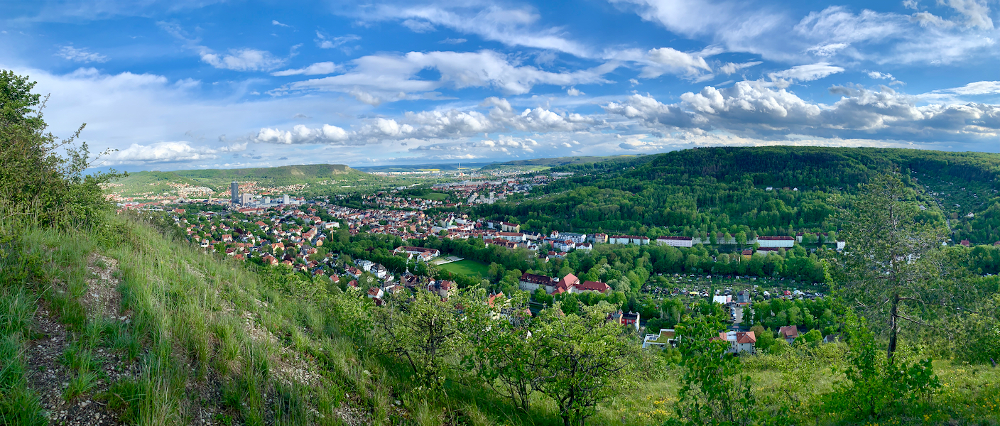
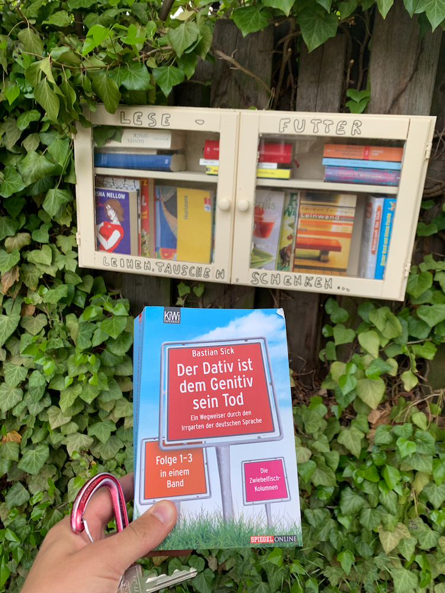
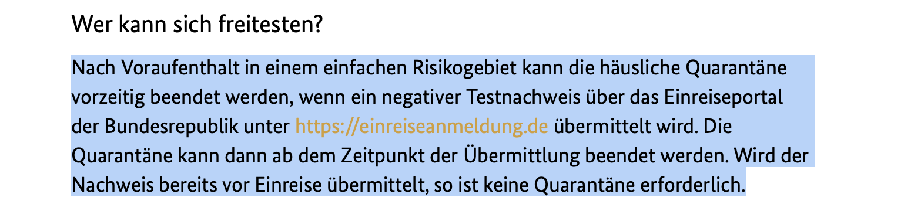
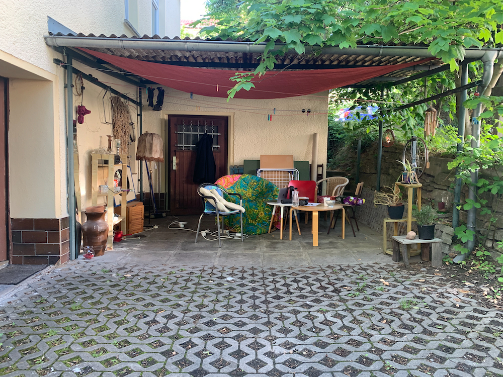
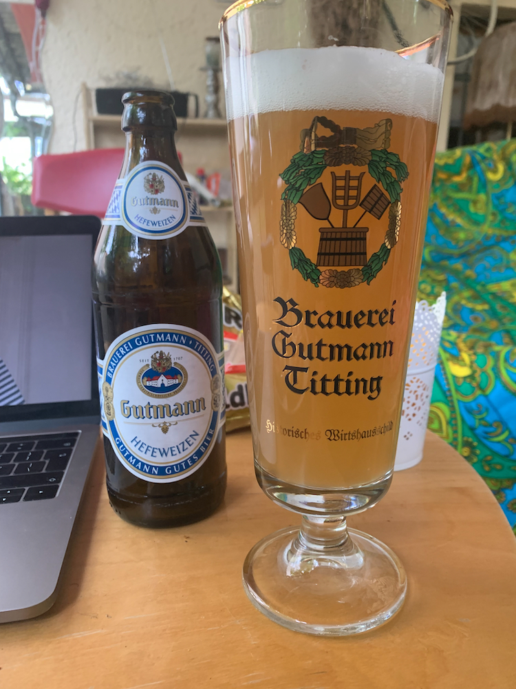
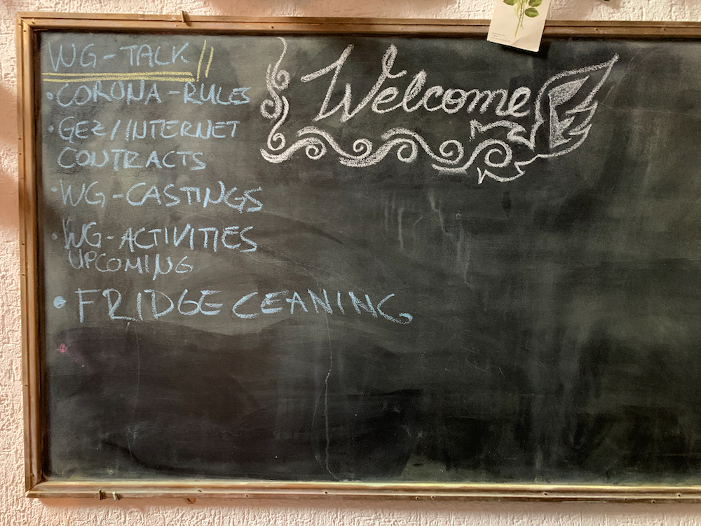

# 2. zápis - první dojmy z Jeny

> Pusťte si první větu Novosvětské symfonie. Kdykoli ji slyším, tak jakoby na mě dýchlo okouzlení novým prostředím, vypořádávání se s nástrahami a radost při seznamování se.

<iframe width="100%" height="315" src="https://www.youtube-nocookie.com/embed/jOofzffyDSA" title="YouTube video player" frameborder="0" allow="accelerometer; autoplay; clipboard-write; encrypted-media; gyroscope; picture-in-picture" allowfullscreen></iframe>

> Rudá pěticípá hvězda zůtulňuje naše společné místo.

Je úterý večer a zrovna se v chodbě, která je také naší jídelnou potkávám se spolubydlící Barbarou. Ptáme se jeden druhého jak se nám daří a když se mě Barb zeptá, tak se chvilku zamyslím a má odpověď vypadá zhruba následujícně: "No víš, ten začátek tady pro mě byl skvělý, byl jsem docela vybuzený ze svého běžného stavu, potkával jsem vás, poznával jsem Jenu, ale už si myslím, že se to začíná ustalovat." Tohle píšu v pátek a těžko říct, jestli jsem do fáze ustalování vkročil už v úterý nebo jsem se do ní dostal až ve čtvrtek.

Když jsem totiž přijel na WGčku skoro nikdo nebyl. Uvítala mě Anjali, má indická spolubydlící, co jako jediná z našeho WG neumí skoro vůbec německy. Doma byl také Felix, jen ten je většinou zašitý u sebe v pokoji a jen občas ho potkám na chodbě. Zrovna jsme večer seděli pod přístřeškem vedle domu, když přijel malý modrý Ford. Z něj vystoupil jeden borec s baretem a kulatými brýlemi, byl skoro jak z filmu a taky druhý borec. Ten měl poměrně dlouhé vlasy všude krom boků, jakoby byl pankáč bez kohouta. Ten k nám přišel a nejistě anglicky řekl: "Ahoj, jsem Dominik." Pochopil jsem, že bude bydlet v druhém volném pokoji. 

## Jena na dlani

V sobotu jsem ještě stihl zaběhnout si do Netto, nejbližšího obchodu. Koupil jsem několik věcí mezi nimi třeba trojbalení mražené pizzy, na které jsem další dny ujížděl. V neděli už moc ani nevím, co jsem dělal, ale jak jsem naposledy psal, tak mi hlavou vrtalo, že bych měl asi zůstat doma a izolovat se. Stejně jsem to nevydržel a odpoledne jsem vyšel na kopec za barákem (jmenuje se _Landgrafen_). Odtud jsem měl možnost vidět celé město pěkně z výšky. 

Začal jsem se snažit poznávat v panoramatu pár bodů, co jsem si pamatoval z poslední návštěvy. Asi nesnáze lze poznat mrakodrap _Jenaturm_ (_der Turm_ - věž). Našel jsem i kampus s Leibnitz institutem, kde mám mít stáž. Byl zde také vidět park Paradies, asi největší čistě zelený ostrov v už tak zeleném městě. 

> Výhled na město z Landgrafen.

## Křenka jednoho doběhne

Vracím se a procházím okolo skříňky s nápisem `Leser Futter` (_Lesen_ - číst, _das Futter_ - krmivo), tedy jakési knihobudky. Říkám si, že se ze zvědavosti podívám. Letmo projíždím knihy a všímám si pouze nějaké učebnice. Otevču pravá dvířka a můj zrak se zarazí na nápisu `DEM GENITIV ...`. Pravní část titulu knihy zakrávají ještě levá dvířka, ale hned jsem si vzpomněl na pana Rybníkáře, co mě šest let učil němčinu a na to jak několikrát zmiňoval, že genitiv (chcete-li druhý pád) v němčině je na ústupu a že nějaký německý jazykovědec napsal knihu s názvem, který jsem si přesně nepamatoval. Jistě jsem ale věděl, že ten název říká, že dativ (třetí pád) zabíjí genitiv. Otevřu levá dvířka a hned vidím na hřbetu nápis `DATIV IST DEM GENITIV ...`. Sáhnu po knize a vidím, že to skutečně je `Dativ ist dem Genitiv sein Tod` od Bastiana Sicka. Opravdu je to ta kniha, o které pan Rybníkář několikrát mluvil. Vzal jsem si ji, že si ji později přečtu.

## Wirklich muss Ordnung sein?

V sobotu, když jsem přijížděl do Německa, tak zrovna první den platila nová pravidla nastolená spolkovým ministerstvem zdravotnictví. Bára mi říkala, že se pravidla změnila a prý karanténa nebude zapotřebí. Úplně jsem nevěřil, že to takhle je a chtěl jsem toto nařízení někde dohledat.

Nakonec jsem na [stránkách Spolkového ministerstva zdravotnictví](https://www.bundesgesundheitsministerium.de/coronavirus-infos-reisende/faq-tests-einreisende.html) našel, že pokud se při příjezdu prokážu negativním testem, tak nemusím do karantény. Jenže v Německo je federace a každá spolková země ba dokonce každé město může mít svá pravidla. Na stránkách Durinska ovšem jsem nenašel žádné nové informace ani na stránkách Jeny. Tak teď úplně nevím, jestli tu náhodou neporušuji karanténí nařízení, když si svobodně pobíhám po venku. 

Je vidět, že občas i Němci nemají ve všem nutně pořádek.

## Spolubydlící

Jelikož v pondělí se slavily v Německu letnice, tak mí spolubydlící začali přijíždět až buďto v pondělí odpoledne nebo později. Právě v pondělí odpoledne jsme se pod přístřeškem na dvorku potkali u kafe spolu s Barbarou a Veronikou. To jsem zjistil, že Veronika se z našeho WG právě odstěhovává, ale bude bydlet jen asi o 4 domy vedle. Zařali jsme se seznamovat, zjistil jsem, že obě jsou z vesnic v Bavorsku a studují tady v Jeně. Veronika studuje dějiny 20. století a říkala, že byla na Erasmu v Praze, takže česko zná. Barbara si dělá doktorát z sociální geografie a ráda cestuje po východě, takže taky něco už v česku viděla. Ale hlavně říkala o jejích zážitcích z Ruska či Ukrajiny.

> Dvorek naší vilky, kde posedáváme a povídáme si.

Později když jsem se začali rozprchávat, tak jsem od každé z nihc dostal pivo z jejich regionu. Veroni mi dala originální bavorské pšeničné pivo z menšího pro mě neznámého pivovaru (_das Wizenbier_ často ale také _das Hefeweizenbier_, _der Weizen_ - pšenice, _die Hefe_ - kvasnice). Barb mi dala pivo, které vaří její bratr. Prý má v Bavorsku pivovar a možná by mi mohla domluvit, že bych se tam mohl podívat.

> Bavorské pšeničné pivo, které jsem dostal od Veroni.

Ve středu, jsme se sešli se dvěma zájemci o volné pokoje v našem WG a k večeru dorazil Xaver, poslední můj spolubydlící, kterého jsem neznal. Taktéž je z Bavorska jen z jiné části. Ono totiž bavorů je víc než čechů, jen rozlohou je tato spolková země malinko menší. Krom toho, mi o Xaverovi ostatní říkali, že je tak trochu sběratel. On je totiž schopný mezi inzeráty na internetu najít spoustu skvělých věcí za odvoz. Takto mi třeba sehnal matraci, psací stů a pěkné kancelářské křeslo. Večer jsme se sesedli okolo stolu, který máme v chodbě a povídali jsme si i Veronika se k nám přidala. Xaver i Veronika přinesli každý nějaké místní pivo, které nebylo zlé.

> Program naší schůze.

Další večer jsme měli schůzku, na které jsme se potkali všichni z našeho WG a asi hodinu a půl jsme řešili věci jako umývání lednice, výběr nového dodavatele internetu, nebo poplatky za veřejnoprávní média.

> Kulturní vložka __média v Německu:__
> 
> V Německu není jen jedna veřejnoprávní televize a jeden rozhlas, ale je jich několik. Jedná se o stanice jako ARD, ZDF, Deutsche Welle, Deutschlandfunk případně regionálnější média jako Norddeutscher Rundfunk (NDR) nebo další jsou na mapě z Wikipedie:

> Němci platí měsíčně koncesionářský poplatek (_die Rundfunkbeitrag_ nebo také _GEZ Gebühr_) 17,50 EUR, tento poplatek zahrnuje všechny stanice. Čili není to tak, že by platili jak čaši zvlášť rozhlas a zvlášť televizi.
> Jinak slovo slovo _die Runfunk_ sice primárně označuje rozhlas, ale často jej naleznete i v názvu televizí, viz třeba NDR. Tedy lze říct, že se jedná o médium, které informace vysílá, nikoliv tiskne.

## Resty z Brna

Ačkoli jsem Brno opustil fyzicky, tak stále jsem si s sebou musel vzít pár nedodělků. Bohužel tyto nedodělky, mě trochu brzdí si Jenu užívat naplno. Jedná se vesměs o zkoušky které budu muset z Německa na dálku dodělat. Prvně jsem musel dodělat výkresy projektu dalekohledu a sepsat o něm zprávu. Aktuálně se učím na zkoušku z elektrodynamiky a speciální teorie relativity a po ní mě čeká zkouška z vybraných kapitol z matematiky I. 

Ačkoli musím říct, že se mi Elektrodynamika jako předmět velmi líbila, počítat elektromagnetická pole mě baví a zároveň jsem v předmětu nenarazil na žádné divnosti, se kterými bych musel bojovat, tak i přes toto všechno mi učení na zkoušku jde dosti pomalu a ztuha. 

Na vybrané kapitoly z matematiky se velmi těším a to protože v tomto předmětu nám byli prezentovány velmi zajímavé koncepty jak přistupovat k řešení problémů a druhak kvůli prof. Druckmüllerovi, který je prostě úžasný.

## Svět je malý

Když jsme si ve středu povídali došla i řeč na moji němčinu. Tak jsem říkal, že jsem si vybral víceleté gymnázium, kde byla rozšířená výuka němčiny a měli jsme i německé učitele. Veronika řekla: "Počkej, já znám jednoho borce, co takhle učil v Česku. Jmenuje se Georg." V tu chvíli mi bylo jasné, že Georgů v česku moc neučí. A divil bych se, kdyby to nebyl ten co učil nás (teda my jsme ho spíš za rok naučili česky). Ukázal jsem ji fotku ze školní Flédy a bylo jasno.

O tom, že tvrzení Arnošta Goldflama z Lotranda a Zubejdy platí v Brně, nemám pochyb. I za hranicemi Brna pro mě poměrně často o náhody není nouze. Ale, přesvědčit se o tom, že svět je malý ve stotisícovém městě uprostřed Německa je slušná náhoda. 

Inu svět je opravdu malý a o náhody v něm není nouze.

> Děkuji všem, kdo nahlašují chyby. Věřím, že každý můj textu pro správného Grammarnazi musí být jak minové pole. Pokud byste se chtěli k čemukoli o čem píšu vyjádřit, doptat a nebo se jen tak ozvat tak pište nebo volejte, rád o vás uslyším.