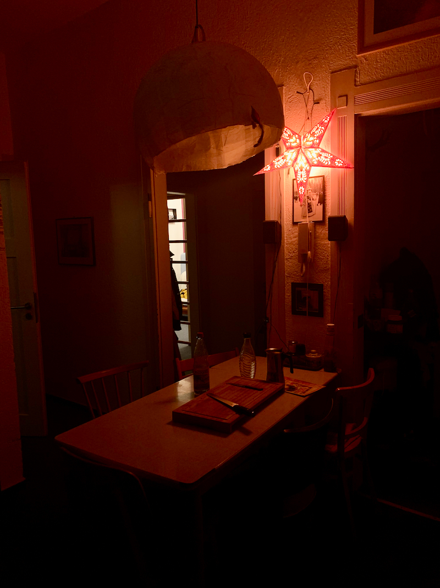
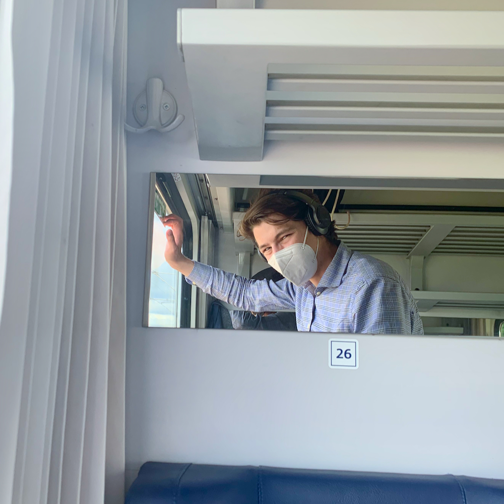
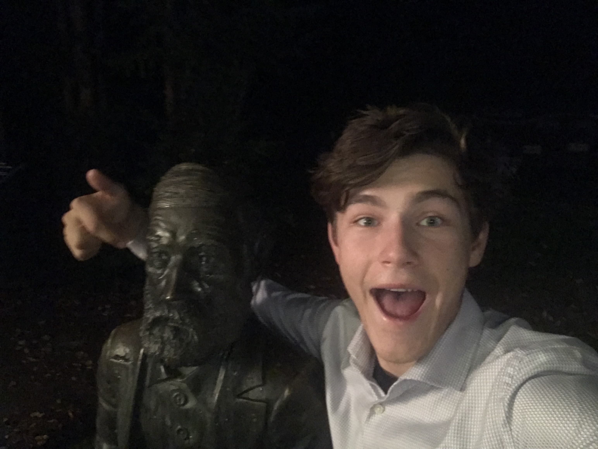

# Kuba's Deutsches Manchmalsbuch
> Chcete-li Kubův německý občasník.

Jednadvacátého května jsem opustil mé rodné Brno a odjel na stáž do německé Jeny. Tady se můžete dočíst o mých pocitech dojmech a zážitcích. 

----

## O čem se tu dočtete?

# [2. zápis - první dojmy z Jeny](2/)
[)](2/) <!-- možná doplnit `html` místo `md`-->

-----

# [1. zápis - cesta a zabydlení se](1/)
 <!-- možná doplnit `html` místo `md`-->

----

# [0. zápis - proč a kam jedu?](0/)
 <!-- možná doplnit `html` místo `md`-->
